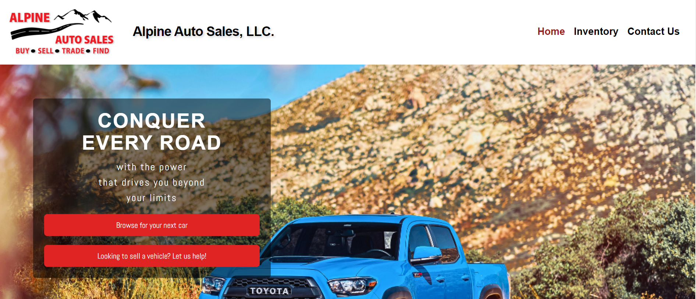
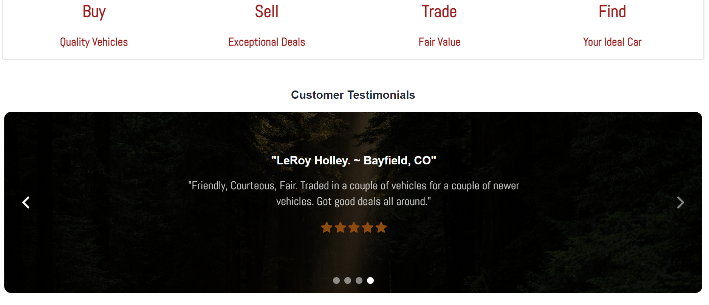
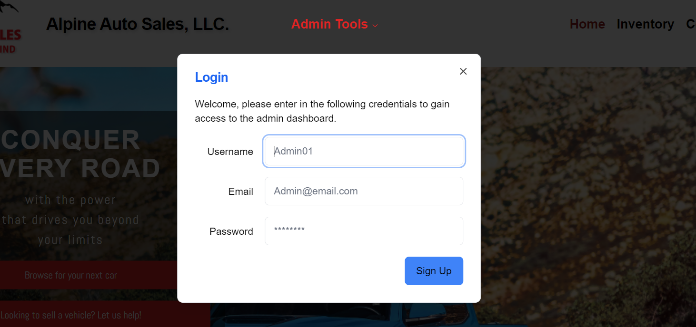
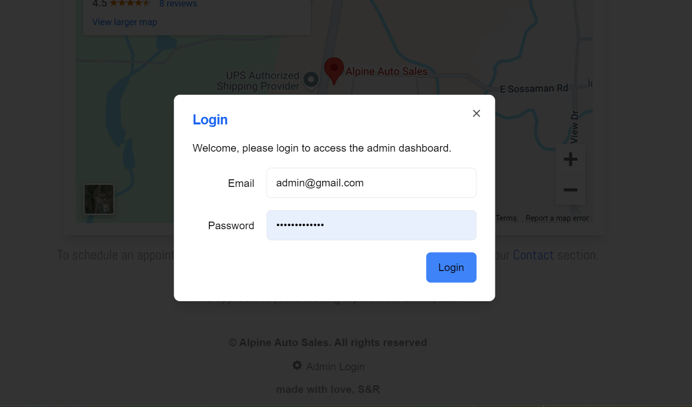
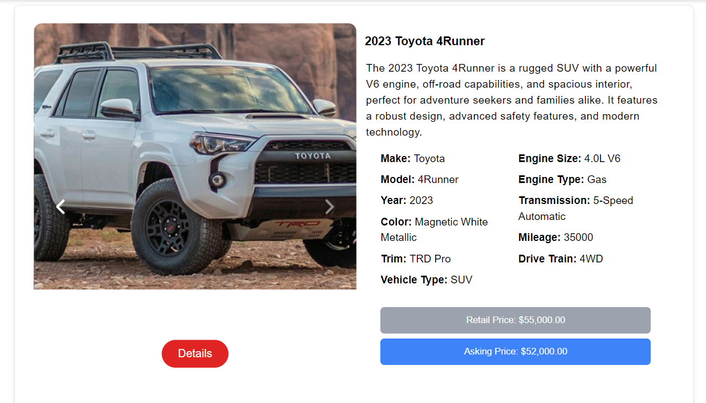
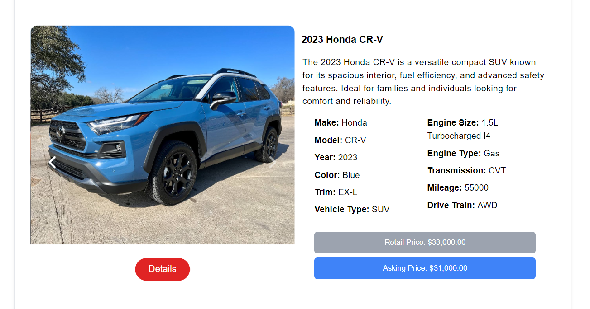
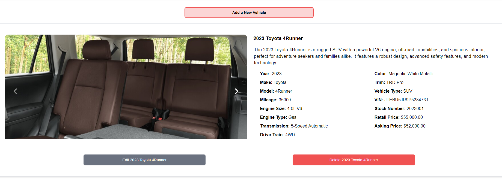
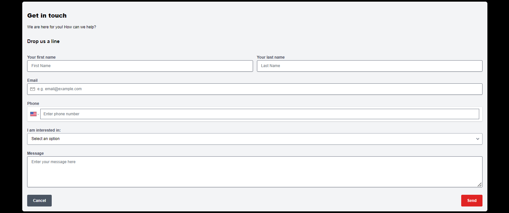
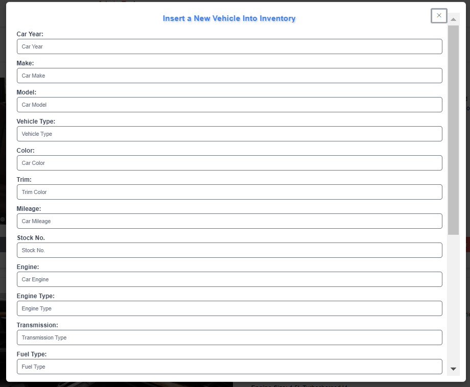
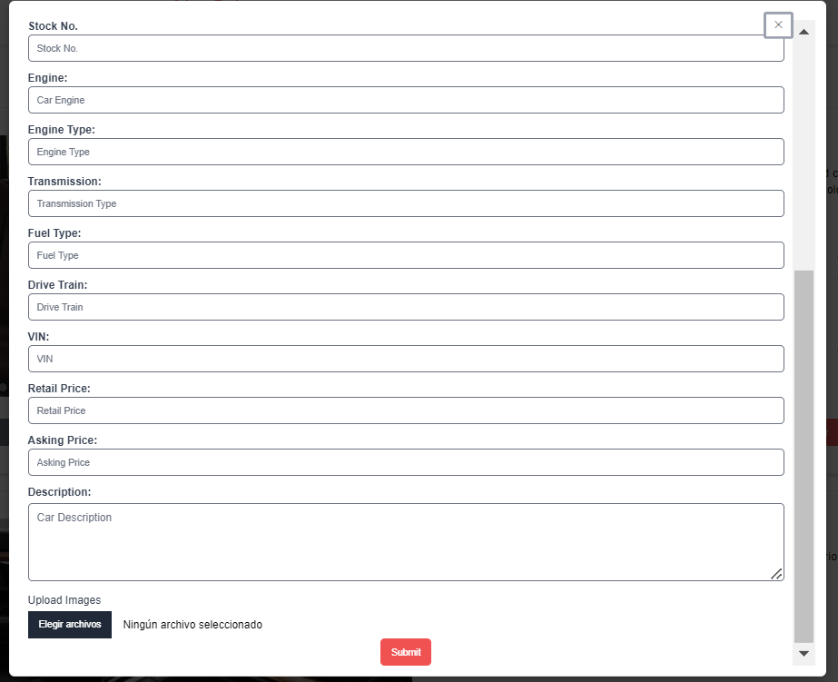

<a name="readme-top"></a>

[![Contributors][contributors-shield]][contributors-url]
[![Forks][forks-shield]][forks-url]
[![Stargazers][stars-shield]][stars-url]
[![Issues][issues-shield]][issues-url]
[![MIT License][license-shield]][license-url]

[contributors-shield]: https://img.shields.io/github/contributors/NathaliaReyes/alpine_auto_cars.svg?style=for-the-badge
[contributors-url]: https://github.com/NathaliaReyes/alpine_auto_cars/graphs/contributors
[forks-shield]: https://img.shields.io/github/forks/NathaliaReyes/alpine_auto_cars.svg?style=for-the-badge
[forks-url]: https://github.com/NathaliaReyes/alpine_auto_cars/network/members
[stars-shield]: https://img.shields.io/github/stars/NathaliaReyes/alpine_auto_cars.svg?style=for-the-badge
[stars-url]: https://github.com/NathaliaReyes/alpine_auto_cars/stargazers
[issues-shield]: https://img.shields.io/github/issues/NathaliaReyes/alpine_auto_cars.svg?style=for-the-badge
[issues-url]: https://github.com/NathaliaReyes/alpine_auto_cars/issues
[license-shield]: https://img.shields.io/github/license/NathaliaReyes/alpine_auto_cars.svg?style=for-the-badge
[license-url]: https://github.com/NathaliaReyes/alpine_auto_cars/blob/main/LICENSE


<br />
<div align="center">
  <a href="https://github.com/NathaliaReyes/alpine_auto_cars.git">

<h1 align="center">Alpine Auto Sales</h1>

  <p align="center">
Alpine-Auto is a full-stack web application built for a small business car dealership. The application allows the dealership to manage its car inventory efficiently, including features for adding, viewing, editing, and deleting car entries. The platform is designed to offer a simple and intuitive user experience.
    <br />
    <a href="https://github.com/NathaliaReyes/alpine_auto_cars.git"><strong>Explore the docs »</strong></a>
    <br />
    <br />
    <a href="https://github.com/NathaliaReyes/alpine_auto_cars.git">View Repository</a>
    ·
    <a href="https://github.com/NathaliaReyes/alpine_auto_cars/issues">Report Bug</a>
    ·
    <a href="https://github.com/NathaliaReyes/alpine_auto_cars/issues">Request Feature</a>
  </p>
</div>

</br>
</br>

<!-- TABLE OF CONTENTS -->
<details>
  <summary>Table of Contents</summary>
  <ol>
    <li>
      <a href="#about-the-project">About The Project</a>
      <ul>
        <li><a href="#built-with">Built With</a></li>
      </ul>
    </li>
    <li>
      <a href="#getting-started">Getting Started</a>
      <ul>
        <li><a href="#installation">Installation</a></li>
      </ul>
    </li>
    <li><a href="#usage">Usage</a></li>
    <li><a href="#contributing">Contributing</a></li>
    <li><a href="#license">License</a></li>
    <li><a href="#contact">Contact</a></li>
     <li><a href="#acknowledgments">Acknowledgments</a></li>
  </ol>
</details>

</br>
</br>

<!-- ABOUT THE PROJECT -->

## About The Project

This is a full-stack web application built in collaboration between Silvia and Becky Feltman, both graduates of the Flex Coding Bootcamp at the University of Denver. This project was developed with a shared vision to create an intuitive and efficient platform for managing car inventory for a small business. By combining their skills in full-stack development, Alpine-Auto offers a robust solution with features like user authentication, detailed car listings, and secure image storage. This project is a reflection of their dedication to providing practical solutions for small businesses through teamwork and innovation.

### Key Features:

- **User Authentication**: Secure login system using JWT tokens to manage access to inventory and administrative features.
- **Inventory Management** Admin users can easily add, edit, and delete car inventory with detailed information such as make, model, price, year, and mileage.
- **Image Upload**: Car images are uploaded securely to AWS S3, and admins can manage the images associated with each car.
- **Responsive Design**: Built with Tailwind CSS to ensure the application works seamlessly across devices and screen sizes.
- **Data Fetching with Apollo Client**: Apollo Client is used to fetch data via GraphQL queries and mutations, ensuring a smooth and fast user experience.
- **UI Components**: Alpine-Auto leverages UI Aceternity to enhance the visual appeal and interactivity of the user interface, providing a clean, modern, and intuitive design.
- **Landing Page**: A professional landing page that showcases the dealership’s car inventory with a clean, user-friendly design.
- **Inventory Display**: Visitors can browse the available cars, with each car entry displaying essential details and images.

### Technologies Used:

- **Frontend**: React, Apollo Client, React Router, TailwindCSS, Framer Motion for animations, UI Aceternity
- **Backend**: MongoDB, Mongoose, Bcrypt, Apollo Server, GraphQL, Node.js, Express
- **Authentication**: JWT tokens, jwt-decode, custom authentication middleware
- **Image Upload**: Multer for file uploads to AWS S3
- **Data Fetching**: Apollo Client for GraphQL queries and mutations
- **Deployment**: AWS EC2 for backend, AWS S3 for image storage, and CloudFront for content delivery
- **Build Tools**: Vite for fast frontend development and build optimization

<p align="right">(<a href="#readme-top">back to top</a>)</p>

### Built With

- 
- 
- 
- 
- 
- 
- 
- 
- 
- 
- 
- 
- 
- 
- 
- 
- 

<!-- GETTING STARTED -->

## Getting Started

### Installation

_To get a local copy up and running follow these simple example steps:_

1. Clone the repo
   ```sh
   HTTP: git clone https://github.com/NathaliaReyes/alpine_auto_cars.git
   SSH: git clone git@github.com:NathaliaReyes/alpine_auto_cars.git
   ```
2. Navigate to the project directory:
   ```sh
   cd alpine_auto_cars
   ```
3. Install the server dependencies:
   ```sh
   npm install
   ```
3. Create a .env file in the server directory and add the following environment variables:
   ```sh
   MONGODB_URI=<your-mongodb-uri>
   AUTH_SECRET=<your-auth-secret>
   DB_NAME=<your-db-name>
   AWS_ACCESS_KEY_ID=<your-aws-access-key-id>
   AWS_SECRET_ACCESS_KEY=<your-aws-secret-access-key>
   AWS_REGION=<your-aws-region>
   AWS_BUCKET_NAME=<your-aws-s3-bucket>
   ```
4. Create a .env file in the client directory and add the following environment variables:
   ```sh
   VITE_AWS_REGION=<your-aws-region>
   VITE_AWS_BUCKET_NAME=<your-aws-bucket-name>
   ```
5. Start the project:
   ```sh
   npm run develop
   ```

<p align="right">(<a href="#readme-top">back to top</a>)</p>

<!-- USAGE EXAMPLES -->

## Usage

<p align="center"><i><strong>✨ Explore the app through these screenshots ✨</strong></i></p>

<div align="center"> 
  </br>
  <strong><i>Watch the demo video:</i></strong>
  
  [](https://drive.google.com/file/d/1CxSo_DGtIHO5r96fMN7_BGL0ZJArjvNF/view?usp=sharing)

  <a href="https://github.com/NathaliaReyes/alpine_auto_cars">
    <p>Loading, Landing Page, About Us</p>
       
       
    </a>
    </br></br>
    <a href="https://github.com/NathaliaReyes/alpine_auto_cars">
    <p>Sign Up & Login</p>
       
       
    </a>
    </br></br>
    <a href="https://github.com/NathaliaReyes/alpine_auto_cars">
      <p>Inventory</p>
      
      
    </a>
    </br></br>
    <a href="https://github.com/NathaliaReyes/alpine_auto_cars">
      <p>Admin Tools</p>
      
    </a>
    </br></br>
    <a href="https://github.com/NathaliaReyes/alpine_auto_cars">
      <p>Forms</p>
      
      
      
    </a>
</br>
</div>
    
      
</br>
</div>

<p align="right">(<a href="#readme-top">back to top</a>)</p>
<!-- CONTRIBUTING -->

## Contributing

Contributions are what make the open source community such an amazing place to learn, inspire, and create. Any contributions you make are **greatly appreciated**!

_If you have a suggestion that would make this better, please fork the repo and create a pull request. You can also simply open an issue with the tag "enhancement".
Don't forget to give the project a star! Thanks again!_

1. Fork the Project
2. Create your Feature Branch (`git checkout -b feature/NewFeature`)
3. Commit your Changes (`git commit -m 'Added ______ , NewFeature'`)
4. Push to the Branch (`git push origin feature/NewFeature`)
5. Open a Pull Request

See the [open issues](https://github.com/NathaliaReyes/alpine_auto_cars/issues) for a full list of proposed features (and known issues).

<p align="right">(<a href="#readme-top">back to top</a>)</p>

<!-- LICENSE -->

## License

<p align='center'>Distributed under the MIT License. See `LICENSE.txt` for more information.</p>
<p align='center'>© Nathalia Reyes · All rights reserved.</p>

<p align="right">(<a href="#readme-top">back to top</a>)</p>

<!-- CONTACT -->

## Contact

- **Silvia Reyes** - [Email her](mailto:snrvdevelopment@gmail.com) - or check her out on [GitHub](https://github.com/NathaliaReyes) or [LinkedIn!](https://www.linkedin.com/in/silviareyes23/)

> Repository Link: [https://github.com/NathaliaReyes/alpine_auto_cars.git](https://github.com/NathaliaReyes/alpine_auto_cars.git)

<p align="right">(<a href="#readme-top">back to top</a>)</p>

<!-- ACKNOWLEDGMENTS -->

## Acknowledgments

- This README file template was created by [@othneildrew](https://github.com/othneildrew) - the original can be found [here](https://github.com/othneildrew/Best-README-Template)

#### Disclaimer:

> We utilized several articles from sources such as (but not limited to) Stack Overflow, W3Schools, and MDN Web Docs, as well as many classwork example code from the University of Denver **as references** for the javascript code attached.
>
> **All of the utilized information has been altered in order to fit this project. This repository contains _solely_ our own work.**

<p align="right">(<a href="#readme-top">back to top</a>)</p>
